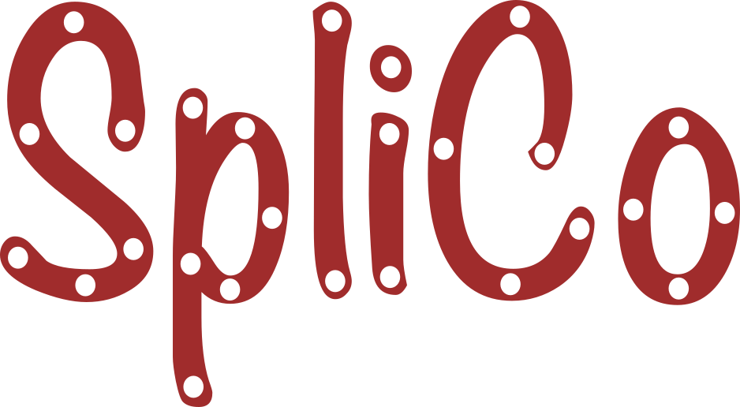

The SpliCo library for spline-based geometric modeling.

The library's most important object is the `NDSplineArray` class, which
supports spline arithmetic using the default `NumPy` syntax.

For instance, let `disc` be a `NDSplineArray<npatches, 3>` that maps a
collection of `npatches` two-dimensional quadrilaterals onto a simply
connected two-dimensional manifold in R^3. Let `X` be a `NDSplineArray<3>`
that maps onto a one-dimensional manifold (curve) in R^3.

The syntax for sweeping the cross-sectional manifold `disc` along `X` is simply

```
_ = np.newaxis

vessel = (disc[:, _] * rRs[_]).sum(-1) + disc.unity * X
```

where `rRs` is a `NDSplineArray<3, 3>` representing (for instance) a
positionally-varying affine transformation of the cross-sectional
manifold.

In the above, we used standard `NumPy` broadcasting rules for matrix
multiplication and other operations.

The library supports:

- Spline arithmetic using the `NumPy` syntax and interoperability with 
`NumPy` arrays.
- Spline evaluation
- Spline fitting (in any dimension)
- Discrete twist-minimizing frame generation
- Sampling classical meshes of various types from the splines along with a
comprehensive module supporting various boolean mesh operations
- Various spline interpolation techniques (linear, cubic-Hermite, ...)
- The library provides an interface to the `Nutils` finite element library
which supports variational techniques based on isogeometric analysis
